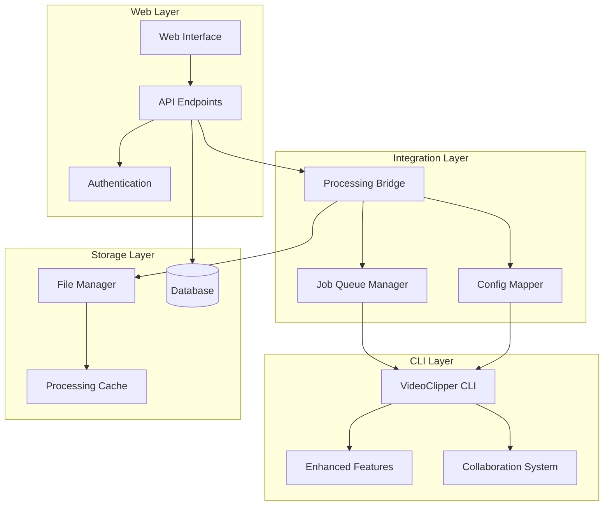
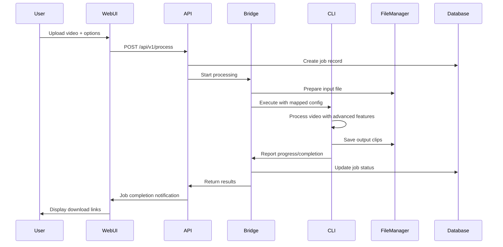

# CLI-Web Integration Design

## Overview

This design integrates the advanced video processing CLI tool (version2/) with the web application (video-clipper-pro/) to provide users with professional-grade video processing through a user-friendly web interface. The integration maintains the full power of the CLI tool while providing seamless web-based access.

## Architecture

### High-Level Architecture



### Component Integration Flow



## Components and Interfaces

### 1. Processing Bridge

The Processing Bridge is the core integration component that connects web requests to CLI execution.

**Interface:**
```typescript
interface ProcessingBridge {
  // Start processing with web parameters
  startProcessing(jobId: string, config: WebProcessingConfig): Promise<ProcessingResult>
  
  // Monitor CLI execution progress
  monitorProgress(jobId: string): AsyncIterator<ProgressUpdate>
  
  // Map web config to CLI parameters
  mapWebConfigToCLI(webConfig: WebProcessingConfig): CLIParameters
  
  // Handle CLI output and errors
  handleCLIOutput(output: string, jobId: string): void
}

interface WebProcessingConfig {
  inputFile: string
  platform: 'tiktok' | 'instagram' | 'youtube' | 'twitter'
  quality: 'standard' | 'high' | 'premium'
  clipCount: number
  enhanceAudio?: boolean
  colorCorrection?: boolean
  smartSelection?: boolean
  collaborationSettings?: CollaborationConfig
}

interface CLIParameters {
  input: string
  platform: string
  quality: string
  clips: number
  enhanceAudio?: boolean
  colorCorrection?: boolean
  smartSelection?: boolean
  outputDir: string
  projectId?: string
  memberId?: string
}
```

**Implementation Strategy:**
- Use Node.js `child_process.spawn()` to execute CLI tool
- Implement real-time stdout/stderr parsing for progress updates
- Create configuration mapping between web options and CLI arguments
- Handle CLI process lifecycle (start, monitor, cleanup)

### 2. Enhanced File Manager

Extends the existing file manager to work with CLI tool requirements.

**Interface:**
```typescript
interface EnhancedFileManager {
  // Prepare uploaded file for CLI processing
  prepareInputFile(uploadedFile: string, jobId: string): Promise<string>
  
  // Create output directory structure
  createOutputStructure(jobId: string): Promise<string>
  
  // Process CLI output files
  processCLIOutput(outputDir: string, jobId: string): Promise<ProcessedFiles>
  
  // Generate secure download URLs
  generateDownloadUrls(files: ProcessedFiles, userId: string): Promise<DownloadUrls>
  
  // Cleanup temporary and old files
  cleanup(jobId: string, maxAge?: number): Promise<void>
}

interface ProcessedFiles {
  clips: Array<{
    filename: string
    path: string
    size: number
    duration: number
    platform: string
  }>
  metadata: {
    totalClips: number
    totalSize: number
    processingTime: number
    qualityUsed: string
  }
}
```

**Implementation Strategy:**
- Create standardized directory structure: `/processed/{userId}/{jobId}/`
- Implement file validation and security checks
- Add metadata extraction from CLI output
- Provide secure, time-limited download URLs

### 3. Job Queue Manager

Manages processing jobs and integrates with the existing database system.

**Interface:**
```typescript
interface JobQueueManager {
  // Add job to processing queue
  enqueueJob(job: ProcessingJob): Promise<string>
  
  // Process jobs with CLI integration
  processQueue(): Promise<void>
  
  // Update job status from CLI feedback
  updateJobProgress(jobId: string, progress: ProgressUpdate): Promise<void>
  
  // Handle job completion
  completeJob(jobId: string, results: ProcessingResults): Promise<void>
  
  // Handle job failures
  failJob(jobId: string, error: ProcessingError): Promise<void>
}

interface ProgressUpdate {
  jobId: string
  progress: number
  stage: 'uploading' | 'processing' | 'enhancing' | 'finalizing'
  message: string
  timestamp: Date
}
```

**Implementation Strategy:**
- Extend existing VideoJobManager with CLI integration
- Implement queue processing with concurrency limits
- Add retry mechanisms for failed jobs
- Integrate with database for persistent job tracking

### 4. Configuration Mapper

Maps web interface options to CLI tool parameters.

**Mapping Rules:**

| Web Option | CLI Parameter | Notes |
|------------|---------------|-------|
| `platform: 'tiktok'` | `--platform tiktok` | Direct mapping |
| `quality: 'high'` | `--quality pro` | Web 'high' → CLI 'pro' |
| `quality: 'premium'` | `--quality cinematic` | Web 'premium' → CLI 'cinematic' |
| `clipCount: 5` | `--clips 5` | Direct mapping |
| `enhanceAudio: true` | `--enhance-audio` | Boolean flag |
| `colorCorrection: true` | `--color-correction` | Boolean flag |
| `smartSelection: true` | `--smart-selection --selection-strategy hybrid` | Enable smart features |

**Advanced Feature Mapping:**
```typescript
interface AdvancedFeatureMapper {
  // Map quality enhancement options
  mapQualityEnhancement(webConfig: WebProcessingConfig): string[]
  
  // Map collaboration settings
  mapCollaborationSettings(settings: CollaborationConfig): string[]
  
  // Map platform-specific optimizations
  mapPlatformOptimizations(platform: string, quality: string): string[]
}
```

## Data Models

### Enhanced Job Model

Extends the existing video job model with CLI integration fields:

```typescript
interface EnhancedVideoJob extends VideoJob {
  // CLI-specific fields
  cliVersion: string
  cliParameters: CLIParameters
  enhancementLevel: 'none' | 'basic' | 'pro' | 'cinematic'
  smartSelectionUsed: boolean
  collaborationContext?: {
    projectId: string
    memberId: string
    templateUsed?: string
  }
  
  // Processing metrics
  processingMetrics: {
    cliExecutionTime: number
    enhancementTime: number
    totalProcessingTime: number
    peakMemoryUsage: number
    cpuUsage: number
  }
  
  // Output metadata
  outputMetadata: {
    clipsGenerated: number
    totalOutputSize: number
    averageClipDuration: number
    qualityMetrics: {
      resolution: string
      bitrate: number
      frameRate: number
    }
  }
}
```

### CLI Integration Configuration

```typescript
interface CLIIntegrationConfig {
  // CLI tool paths
  cliPath: string
  pythonPath: string
  workingDirectory: string
  
  // Processing limits
  maxConcurrentJobs: number
  maxFileSize: number
  timeoutMinutes: number
  
  // Feature flags
  enableSmartSelection: boolean
  enableCollaboration: boolean
  enableQualityEnhancement: boolean
  
  // Resource management
  tempDirectory: string
  outputDirectory: string
  cleanupIntervalHours: number
}
```

## Error Handling

### Error Categories and Responses

1. **File Upload Errors**
   - Invalid file format → "Please upload a supported video format (MP4, MOV, AVI)"
   - File too large → "File size exceeds limit. Please upload a file smaller than {limit}MB"
   - Upload timeout → "Upload timed out. Please check your connection and try again"

2. **CLI Execution Errors**
   - CLI not found → "Video processing service unavailable. Please try again later"
   - Invalid parameters → "Invalid processing configuration. Please check your settings"
   - Processing timeout → "Processing took too long. Please try with a shorter video"

3. **Resource Errors**
   - Insufficient disk space → "Server storage full. Please try again later"
   - Memory exhaustion → "Video too complex to process. Please try with lower quality settings"
   - Queue full → "Processing queue is full. Estimated wait time: {minutes} minutes"

### Error Recovery Strategies

```typescript
interface ErrorRecoveryStrategy {
  // Automatic retry for transient errors
  retryTransientErrors(error: ProcessingError, attempt: number): boolean
  
  // Fallback to basic processing for complex videos
  fallbackToBasicProcessing(jobId: string): Promise<void>
  
  // Cleanup failed processing attempts
  cleanupFailedJob(jobId: string): Promise<void>
  
  // Notify user of permanent failures
  notifyUserOfFailure(jobId: string, error: ProcessingError): Promise<void>
}
```

## Testing Strategy

### Integration Testing

1. **End-to-End Flow Testing**
   - Upload video → Process with CLI → Download clips
   - Test all quality presets and platform options
   - Verify advanced features work correctly

2. **CLI Integration Testing**
   - Mock CLI execution for unit tests
   - Test parameter mapping accuracy
   - Verify progress parsing and error handling

3. **Performance Testing**
   - Test with various file sizes and formats
   - Measure processing times and resource usage
   - Test concurrent job processing

4. **Error Scenario Testing**
   - Test CLI crashes and timeouts
   - Test invalid file formats and corrupted uploads
   - Test resource exhaustion scenarios

### Test Implementation

```typescript
// Example integration test
describe('CLI-Web Integration', () => {
  test('should process video with advanced features', async () => {
    const config: WebProcessingConfig = {
      inputFile: 'test-video.mp4',
      platform: 'tiktok',
      quality: 'high',
      clipCount: 3,
      enhanceAudio: true,
      smartSelection: true
    }
    
    const result = await processingBridge.startProcessing('test-job', config)
    
    expect(result.success).toBe(true)
    expect(result.clips).toHaveLength(3)
    expect(result.enhancementUsed).toBe(true)
  })
})
```

## Performance Considerations

### Optimization Strategies

1. **Processing Queue Management**
   - Implement job prioritization based on user subscription
   - Use worker pools for concurrent processing
   - Add job scheduling for off-peak processing

2. **File Management Optimization**
   - Implement streaming uploads for large files
   - Use compression for temporary file storage
   - Add CDN integration for download delivery

3. **CLI Process Optimization**
   - Reuse CLI processes when possible
   - Implement process pooling for faster startup
   - Add caching for frequently used configurations

4. **Resource Monitoring**
   - Monitor CPU, memory, and disk usage
   - Implement automatic scaling based on load
   - Add alerts for resource exhaustion

## Security Considerations

### Security Measures

1. **File Security**
   - Validate all uploaded files for malicious content
   - Isolate processing in sandboxed environments
   - Implement secure file storage with encryption

2. **Process Security**
   - Run CLI processes with limited privileges
   - Implement timeout and resource limits
   - Add process monitoring and anomaly detection

3. **Access Control**
   - Ensure users can only access their own files
   - Implement secure download URLs with expiration
   - Add audit logging for all file operations

4. **Data Protection**
   - Encrypt sensitive data in transit and at rest
   - Implement secure deletion of temporary files
   - Add compliance with data protection regulations

This design provides a comprehensive integration between your powerful CLI tool and web application, ensuring users get the full benefit of your advanced video processing capabilities through an intuitive web interface.