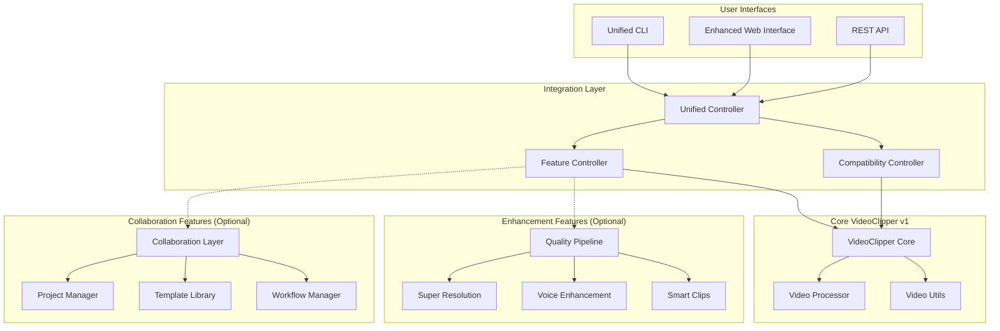

# Integration & Deployment Design Document

## Overview

The Integration & Deployment phase represents the culmination of VideoClipper v2.0 development, unifying quality enhancement and team collaboration features into a cohesive system while maintaining complete backward compatibility. This design ensures that existing v1 users experience zero disruption while enabling powerful new capabilities for those who choose to adopt them.

The architecture follows a layered approach where v1 functionality remains the stable core, with v2 features implemented as optional enhancements that can be independently enabled, disabled, or updated.

## Architecture

### System Architecture



### Feature Detection and Loading

The system uses dynamic feature detection to determine available capabilities:

```python
# Feature availability detection
ENHANCEMENT_AVAILABLE = check_enhancement_dependencies()
COLLABORATION_AVAILABLE = check_collaboration_dependencies()

# Dynamic feature loading
if ENHANCEMENT_AVAILABLE:
    from .enhancement import QualityPipeline
if COLLABORATION_AVAILABLE:
    from .collaboration import CollaborationLayer
```

### Backward Compatibility Strategy

1. **Command Preservation**: All v1 commands work identically
2. **Output Preservation**: Same file formats and directory structures
3. **API Preservation**: Existing endpoints maintain exact behavior
4. **Performance Preservation**: No overhead for v1 operations
5. **Configuration Preservation**: Existing config files work unchanged

## Components and Interfaces

### 1. Unified CLI Integration

**Purpose**: Single entry point that routes to appropriate processing based on feature flags

**Key Components**:
- `UnifiedVideoClipper`: Main controller class
- `create_unified_parser()`: Argument parser with all features
- Feature detection and routing logic
- Backward compatibility validation

**Interface Design**:
```python
class UnifiedVideoClipper:
    def __init__(self, args: argparse.Namespace):
        self.enhancement_enabled = self._should_enable_enhancements(args)
        self.collaboration_enabled = self._should_enable_collaboration(args)
        self.clipper = self._create_appropriate_clipper(args)
    
    def process(self) -> int:
        # Route to appropriate processing method
        pass
```

### 2. Enhanced Help System

**Purpose**: Comprehensive help that guides users through v1 and v2 features

**Key Components**:
- Context-aware help based on available features
- Migration guidance and examples
- Feature-specific detailed guides
- Troubleshooting documentation

**Help Categories**:
- Quick help for common use cases
- Detailed examples by feature category
- Migration guide from v1 to v2
- Feature-specific guides
- Troubleshooting and FAQ

### 3. Web Interface Enhancement

**Purpose**: Extend existing web interface with optional v2 capabilities

**Key Components**:
- Enhanced processing form with optional v2 controls
- Feature availability detection in templates
- Backward-compatible API endpoints
- Progressive enhancement for new features

**Design Principles**:
- Existing interface remains unchanged by default
- New features appear only when available and relevant
- All new controls are clearly marked as optional
- Graceful degradation when features unavailable

### 4. Comprehensive Testing Framework

**Purpose**: Validate backward compatibility and new feature integration

**Test Categories**:
- **Backward Compatibility Tests**: Ensure v1 behavior unchanged
- **Feature Integration Tests**: Validate v2 features work correctly
- **Performance Tests**: Verify no degradation in v1 operations
- **Cross-Platform Tests**: Validate across different hardware

**Test Structure**:
```python
class BackwardCompatibilityTests:
    def test_v1_commands_unchanged(self):
        # Test all v1 commands produce identical results
        pass
    
    def test_v1_performance_maintained(self):
        # Benchmark v1 operations
        pass

class FeatureIntegrationTests:
    def test_enhancement_opt_in(self):
        # Test enhancement features are opt-in only
        pass
    
    def test_collaboration_isolation(self):
        # Test collaboration features don't affect core
        pass
```

## Data Models

### Configuration Management

```python
@dataclass
class VideoClipperConfig:
    # v1 compatible settings
    quality: str = "standard"
    clips: int = 5
    output_dir: str = "output"
    
    # v2 enhancement settings (optional)
    enhance_quality: bool = False
    super_resolution: bool = False
    voice_enhancement: bool = False
    
    # v2 collaboration settings (optional)
    project_id: Optional[str] = None
    member_id: Optional[str] = None
    template: Optional[str] = None
```

### Processing Results

```python
@dataclass
class ProcessingResult:
    success: bool
    clips_generated: int
    processing_time: float
    
    # v2 enhancement results (optional)
    enhancement_applied: Optional[Dict[str, Any]] = None
    quality_metrics: Optional[Dict[str, float]] = None
    
    # v2 collaboration results (optional)
    collaboration_info: Optional[Dict[str, Any]] = None
    project_stats: Optional[Dict[str, Any]] = None
```

## Error Handling

### Graceful Feature Degradation

```python
def handle_missing_features(args: argparse.Namespace) -> None:
    """Handle cases where requested features are unavailable."""
    
    if args.enhance_quality and not ENHANCEMENT_AVAILABLE:
        print("⚠️  Enhancement features not available. Install with: pip install videoclipper[enhancement]")
        print("🔄 Continuing with standard processing...")
    
    if args.project_id and not COLLABORATION_AVAILABLE:
        print("⚠️  Collaboration features not available. Install with: pip install videoclipper[collaboration]")
        print("🔄 Continuing with individual processing...")
```

### Error Recovery Strategies

1. **Feature Unavailable**: Continue with available features, clear messaging
2. **Dependency Missing**: Provide installation instructions, fallback to v1
3. **Configuration Error**: Validate and suggest corrections
4. **Processing Error**: Detailed error reporting with troubleshooting hints

## Testing Strategy

### 1. Backward Compatibility Validation

**Objective**: Ensure 100% compatibility with v1 behavior

**Test Approach**:
- Run existing v1 test suite against v2.0
- Compare outputs byte-for-byte with v1 results
- Benchmark performance against v1 baseline
- Test with real-world v1 scripts and configurations

**Success Criteria**:
- All v1 tests pass without modification
- Performance within 5% of v1 baseline
- Identical output formats and file structures

### 2. Feature Integration Testing

**Objective**: Validate v2 features work correctly and don't interfere with core functionality

**Test Approach**:
- Test each feature in isolation
- Test feature combinations
- Test feature availability detection
- Test graceful degradation when features unavailable

**Success Criteria**:
- Features are truly opt-in (no impact when disabled)
- Feature combinations work correctly
- Clear error messages when features unavailable

### 3. Performance Testing

**Objective**: Ensure v2.0 doesn't degrade v1 performance

**Test Approach**:
- Benchmark startup time with and without features
- Memory usage profiling for different configurations
- Processing speed comparison across feature sets
- Resource utilization monitoring

**Success Criteria**:
- Startup time unchanged for v1 operations
- Memory usage unchanged for basic processing
- Processing speed maintained for equivalent operations

### 4. Cross-Platform Testing

**Objective**: Validate functionality across different hardware and OS combinations

**Test Platforms**:
- macOS (Intel, Apple Silicon)
- Linux (AMD64, ARM64)
- Windows (Intel, AMD)

**Test Focus**:
- Feature availability detection
- Performance characteristics
- Dependency handling
- Error message clarity

## Deployment Architecture

### Installation Options

```bash
# Basic installation (v1 compatible)
pip install videoclipper

# With enhancement features
pip install videoclipper[enhancement]

# With collaboration features  
pip install videoclipper[collaboration]

# Full installation
pip install videoclipper[enhancement,collaboration]
```

### Feature Module Structure

```
videoclipper/
├── core/                    # v1 compatible core (always installed)
│   ├── clipper.py
│   ├── video_utils.py
│   └── web_interface.py
├── enhancement/             # Optional enhancement features
│   ├── quality_pipeline.py
│   ├── super_resolution.py
│   └── voice_enhancement.py
├── collaboration/           # Optional collaboration features
│   ├── collaboration_layer.py
│   ├── project_manager.py
│   └── template_library.py
└── integration/             # Integration layer
    ├── unified_cli.py
    ├── help_system.py
    └── compatibility.py
```

### Configuration Management

**Default Configuration** (v1 compatible):
```yaml
videoclipper:
  quality: standard
  clips: 5
  output_dir: output
  
  # v2 features (disabled by default)
  features:
    enhancement: false
    collaboration: false
```

**Enhanced Configuration** (opt-in v2):
```yaml
videoclipper:
  quality: standard
  clips: 5
  output_dir: output
  
  features:
    enhancement: true
    collaboration: true
  
  enhancement:
    super_resolution: true
    voice_enhancement: false
  
  collaboration:
    default_project: "team_project"
    member_id: "user123"
```

## Migration Strategy

### Phase 1: Silent Upgrade
- Install v2.0 with identical v1 behavior
- No user action required
- All existing scripts work unchanged

### Phase 2: Feature Discovery
- Users discover new features through help system
- Optional features clearly marked
- Examples show gradual adoption

### Phase 3: Gradual Adoption
- Users enable specific features as needed
- Mix v1 and v2 capabilities
- Performance and functionality validated

### Phase 4: Full Utilization
- Users adopt comprehensive v2 workflows
- Team collaboration features enabled
- Advanced enhancement features utilized

## Performance Requirements

### Baseline Performance (v1 Operations)
- **Startup Time**: ≤ v1 baseline (no degradation)
- **Memory Usage**: ≤ v1 baseline for basic operations
- **Processing Speed**: ≥ 95% of v1 speed for equivalent operations
- **Resource Utilization**: No increase for v1 workflows

### Enhanced Performance (v2 Operations)
- **Enhancement Features**: Clear performance impact documentation
- **Collaboration Features**: Minimal overhead for individual processing
- **Feature Combinations**: Predictable performance characteristics
- **Scalability**: Maintain performance with team features enabled

## Security Considerations

### Backward Compatibility Security
- All v1 security measures preserved
- No new attack vectors introduced
- Existing security configurations remain valid

### New Feature Security
- Team collaboration features include access controls
- API endpoints maintain existing authentication
- New endpoints follow established security patterns
- Clear separation between individual and team data

## Documentation Strategy

### User Documentation
1. **Quick Start Guide**: Get running with v1 compatibility
2. **Feature Guide**: Detailed v2 feature documentation
3. **Migration Guide**: Step-by-step upgrade path
4. **API Reference**: Complete endpoint documentation
5. **Troubleshooting**: Common issues and solutions

### Developer Documentation
1. **Architecture Overview**: System design and component interaction
2. **Feature Development**: Adding new enhancement or collaboration features
3. **Testing Guide**: Running and extending the test suite
4. **Deployment Guide**: Installation and configuration options
5. **Contributing Guide**: Development workflow and standards

This design ensures VideoClipper v2.0 delivers powerful new capabilities while maintaining the reliability and simplicity that existing users depend on.