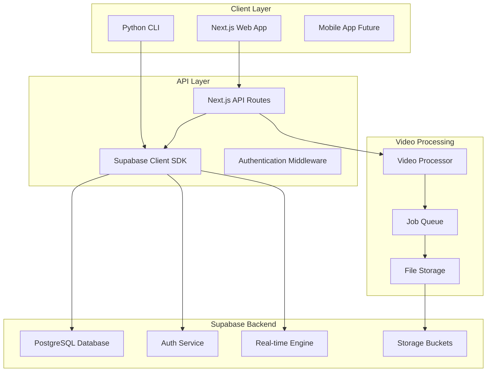
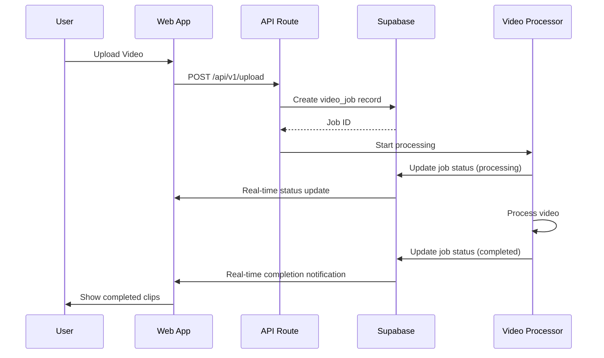

# Supabase Database Integration Design

## Overview

This design implements a comprehensive database layer using Supabase to transform the Video Clipper Pro from a standalone tool into a full-featured SaaS application. The integration provides user management, job tracking, team collaboration, and usage analytics while maintaining the existing video processing capabilities.

## Architecture

### Database Layer Architecture



### Data Flow Architecture



## Components and Interfaces

### 1. Database Schema Components

#### Core Tables
- **users**: Extended user profiles with subscription tiers
- **teams**: Team workspaces for collaboration
- **video_jobs**: Processing job tracking and metadata
- **templates**: Saved processing configurations
- **team_members**: Junction table for team membership
- **usage_tracking**: Resource consumption monitoring

#### Relationships
- Users can belong to multiple teams (many-to-many)
- Teams have one owner but multiple members
- Video jobs belong to users and optionally teams
- Templates can be personal or shared within teams
- Usage tracking aggregates by user and team

### 2. Authentication System

#### Supabase Auth Integration
```typescript
interface AuthConfig {
  providers: ['email', 'google', 'github']
  emailConfirmation: boolean
  passwordPolicy: {
    minLength: 8
    requireSpecialChar: boolean
    requireNumber: boolean
  }
}
```

#### User Profile Management
```typescript
interface UserProfile {
  id: string
  email: string
  subscription_tier: 'free' | 'pro' | 'business'
  team_id?: string
  created_at: string
  updated_at: string
}
```

### 3. Job Management System

#### Video Job Interface
```typescript
interface VideoJob {
  id: string
  user_id: string
  team_id?: string
  original_filename: string
  original_filesize: number
  status: 'queued' | 'processing' | 'completed' | 'failed'
  clip_count: number
  quality_preset: 'social' | 'pro' | 'cinematic'
  enhancement_level: 'none' | 'basic' | 'pro' | 'cinematic'
  platform_target?: 'tiktok' | 'instagram' | 'youtube_shorts'
  output_files?: string[]
  processing_time?: number
  created_at: string
  started_at?: string
  completed_at?: string
}
```

#### Job Status Management
```python
class VideoJobManager:
    def create_job(self, user_id: str, settings: dict) -> VideoJob
    def update_status(self, job_id: str, status: str, output_files?: list) -> VideoJob
    def get_user_jobs(self, user_id: str, limit: int = 50) -> list[VideoJob]
    def get_team_jobs(self, team_id: str, limit: int = 50) -> list[VideoJob]
```

### 4. Template System

#### Template Interface
```typescript
interface ProcessingTemplate {
  id: string
  name: string
  user_id: string
  team_id?: string
  settings: {
    clip_count: number
    quality_preset: string
    enhancement_level: string
    platform_target?: string
    custom_options: Record<string, any>
  }
  is_shared: boolean
  used_count: number
  created_at: string
  updated_at: string
}
```

#### Template Operations
```python
class TemplateManager:
    def create_template(self, user_id: str, name: str, settings: dict) -> Template
    def get_user_templates(self, user_id: str, team_id?: str) -> list[Template]
    def share_template(self, template_id: str, team_id: str) -> bool
    def increment_usage(self, template_id: str) -> void
```

### 5. Team Collaboration System

#### Team Management
```typescript
interface Team {
  id: string
  name: string
  owner_id: string
  member_limit: number
  created_at: string
  updated_at: string
}

interface TeamMember {
  id: string
  team_id: string
  user_id: string
  role: 'owner' | 'admin' | 'editor' | 'viewer'
  invited_by: string
  joined_at: string
}
```

#### Permission System
```python
class TeamPermissions:
    OWNER = ['manage_team', 'invite_members', 'process_videos', 'view_analytics']
    ADMIN = ['invite_members', 'process_videos', 'view_analytics']
    EDITOR = ['process_videos', 'view_analytics']
    VIEWER = ['view_analytics']
    
    def check_permission(self, user_id: str, team_id: str, action: str) -> bool
```

### 6. Usage Tracking System

#### Usage Metrics
```typescript
interface UsageTracking {
  id: string
  user_id: string
  team_id?: string
  clips_processed: number
  processing_time: number  // seconds
  storage_used: number     // bytes
  period_month: number
  period_year: number
  created_at: string
}
```

#### Tier Limits
```python
TIER_LIMITS = {
    'free': {
        'clips_per_month': 10,
        'processing_time_minutes': 60,
        'storage_gb': 1,
        'team_members': 1
    },
    'pro': {
        'clips_per_month': 100,
        'processing_time_minutes': 600,
        'storage_gb': 10,
        'team_members': 5
    },
    'business': {
        'clips_per_month': 1000,
        'processing_time_minutes': 6000,
        'storage_gb': 100,
        'team_members': 25
    }
}
```

## Data Models

### 1. User Management Models

```python
from dataclasses import dataclass
from datetime import datetime
from typing import Optional

@dataclass
class User:
    id: str
    email: str
    subscription_tier: str = 'free'
    team_id: Optional[str] = None
    created_at: datetime = None
    updated_at: datetime = None
```

### 2. Video Processing Models

```python
@dataclass
class VideoJob:
    id: str
    user_id: str
    original_filename: str
    original_filesize: int
    status: str = 'queued'
    clip_count: int = 5
    quality_preset: str = 'social'
    enhancement_level: str = 'none'
    platform_target: Optional[str] = None
    output_files: Optional[list] = None
    processing_time: Optional[int] = None
    team_id: Optional[str] = None
    created_at: datetime = None
    started_at: Optional[datetime] = None
    completed_at: Optional[datetime] = None
```

### 3. Collaboration Models

```python
@dataclass
class Team:
    id: str
    name: str
    owner_id: str
    member_limit: int = 1
    created_at: datetime = None
    updated_at: datetime = None

@dataclass
class TeamMember:
    id: str
    team_id: str
    user_id: str
    role: str = 'editor'
    invited_by: str
    joined_at: datetime = None
```

## Error Handling

### 1. Database Connection Errors

```python
class DatabaseError(Exception):
    """Base exception for database operations"""
    pass

class ConnectionError(DatabaseError):
    """Database connection failed"""
    pass

class AuthenticationError(DatabaseError):
    """Authentication failed"""
    pass

class PermissionError(DatabaseError):
    """Insufficient permissions"""
    pass
```

### 2. Error Recovery Strategies

- **Connection Retry**: Implement exponential backoff for connection failures
- **Graceful Degradation**: Fall back to local processing if database unavailable
- **Transaction Rollback**: Ensure data consistency on operation failures
- **User Notification**: Provide clear error messages for user-facing issues

### 3. Validation and Constraints

```python
def validate_video_job(job_data: dict) -> bool:
    """Validate video job data before database insertion"""
    required_fields = ['user_id', 'original_filename', 'original_filesize']
    
    for field in required_fields:
        if field not in job_data:
            raise ValidationError(f"Missing required field: {field}")
    
    if job_data['original_filesize'] > MAX_FILE_SIZE:
        raise ValidationError("File size exceeds limit")
    
    return True
```

## Testing Strategy

### 1. Unit Testing

- **Database Operations**: Test CRUD operations for all models
- **Authentication**: Test user registration, login, and permission checks
- **Job Management**: Test job creation, status updates, and retrieval
- **Template System**: Test template creation, sharing, and usage tracking

### 2. Integration Testing

- **API Endpoints**: Test complete request/response cycles
- **Real-time Updates**: Test WebSocket connections and notifications
- **File Upload Flow**: Test end-to-end video processing with database tracking
- **Team Collaboration**: Test multi-user scenarios and permission enforcement

### 3. Performance Testing

- **Database Queries**: Optimize query performance with proper indexing
- **Concurrent Users**: Test system behavior under load
- **Real-time Scaling**: Test WebSocket connection limits
- **Storage Operations**: Test file upload/download performance

### 4. Security Testing

- **SQL Injection**: Test parameterized queries and input validation
- **Authentication Bypass**: Test RLS policies and permission checks
- **Data Leakage**: Ensure users can only access authorized data
- **API Security**: Test rate limiting and authentication requirements

## Implementation Phases

### Phase 1: Core Database Setup
1. Supabase project configuration
2. Database schema creation
3. RLS policy implementation
4. Basic authentication setup

### Phase 2: Job Management Integration
1. Video job tracking implementation
2. Status update mechanisms
3. Real-time notifications
4. API endpoint updates

### Phase 3: User Management
1. User profile management
2. Subscription tier enforcement
3. Usage tracking implementation
4. Dashboard development

### Phase 4: Team Collaboration
1. Team creation and management
2. Member invitation system
3. Permission-based access control
4. Shared template system

### Phase 5: Advanced Features
1. Analytics dashboard
2. Billing integration
3. Advanced usage monitoring
4. Performance optimization