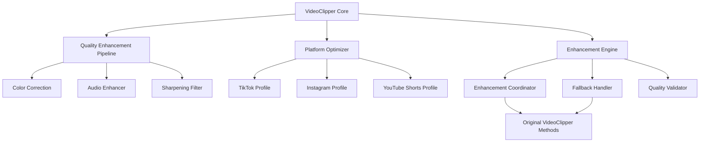
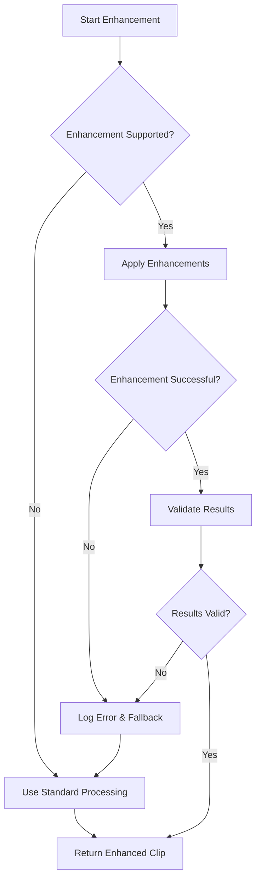

# Design Document

## Overview

The Video Quality Enhancement feature extends the existing VideoClipper v2 system with advanced video processing capabilities while maintaining full backward compatibility. This enhancement adds intelligent quality improvements, platform-specific optimizations, and color/audio corrections that integrate seamlessly with the current workflow.

The design follows a modular approach, creating new enhancement components that extend the existing VideoClipper class without breaking current functionality. All existing CLI arguments, API endpoints, and processing workflows remain unchanged when enhancement features are not explicitly enabled.

## Architecture

### High-Level Architecture



### Integration Points

The enhancement system integrates with the existing VideoClipper architecture at these key points:

1. **VideoClipper.__init__()** - Initialize enhancement components
2. **VideoClipper.get_export_preset()** - Extend with enhancement-aware presets
3. **VideoClipper._process_single_clip()** - Add enhancement processing step
4. **CLI argument parsing** - Add optional enhancement flags
5. **Web API endpoints** - Add optional enhancement parameters

## Components and Interfaces

### 1. Quality Enhancement Pipeline

**File**: `version2/enhancement/quality_pipeline.py`

```python
class QualityEnhancementPipeline:
    """Core quality enhancement system that coordinates all improvements."""
    
    def __init__(self, debug: bool = False):
        self.debug = debug
        self.color_corrector = ColorCorrector()
        self.audio_enhancer = AudioEnhancer()
        self.sharpening_filter = SharpeningFilter()
    
    def enhance_clip(self, clip: VideoFileClip, quality_level: str = "standard") -> VideoFileClip:
        """Apply quality enhancements to a video clip."""
        
    def is_enhancement_supported(self, clip: VideoFileClip) -> bool:
        """Check if clip is suitable for enhancement."""
        
    def get_enhancement_settings(self, quality_level: str) -> Dict[str, Any]:
        """Get enhancement settings for quality level."""
```

**Interface with VideoClipper**:
- Extends `_process_single_clip()` method
- Integrates with existing quality presets
- Maintains audio track integrity
- Preserves all existing clip properties

### 2. Color Correction Component

**File**: `version2/enhancement/color_correction.py`

```python
class ColorCorrector:
    """Handles color space corrections and improvements."""
    
    def correct_colors(self, clip: VideoFileClip, profile: str = "auto") -> VideoFileClip:
        """Apply color corrections based on analysis."""
        
    def analyze_color_profile(self, clip: VideoFileClip) -> Dict[str, float]:
        """Analyze clip color characteristics."""
        
    def apply_lut(self, clip: VideoFileClip, lut_path: str) -> VideoFileClip:
        """Apply Look-Up Table for color grading."""
```

### 3. Audio Enhancement Component

**File**: `version2/enhancement/audio_enhancer.py`

```python
class AudioEnhancer:
    """Advanced audio processing beyond basic enhancement."""
    
    def enhance_audio_advanced(self, clip: VideoFileClip, settings: Dict[str, Any]) -> VideoFileClip:
        """Apply advanced audio enhancements."""
        
    def analyze_audio_quality(self, clip: VideoFileClip) -> Dict[str, float]:
        """Analyze audio characteristics for enhancement."""
        
    def apply_noise_reduction(self, clip: VideoFileClip) -> VideoFileClip:
        """Apply intelligent noise reduction."""
```

### 4. Platform Optimizer

**File**: `version2/enhancement/platform_optimizer.py`

```python
class PlatformOptimizer:
    """Platform-specific video optimizations."""
    
    def optimize_for_platform(self, clip: VideoFileClip, platform: str) -> VideoFileClip:
        """Apply platform-specific optimizations."""
        
    def get_platform_settings(self, platform: str) -> Dict[str, Any]:
        """Get encoding settings for specific platform."""
        
    SUPPORTED_PLATFORMS = ["tiktok", "instagram", "youtube_shorts"]
```

### 5. Quality Presets Extension

**File**: `version2/enhancement/quality_presets.py`

```python
class EnhancedQualityPresets:
    """Extended quality presets with enhancement options."""
    
    def get_enhanced_preset(self, base_preset: str, enhancement_level: str) -> Dict[str, Any]:
        """Get enhanced version of existing preset."""
        
    def merge_enhancement_settings(self, base_settings: Dict, enhancements: Dict) -> Dict:
        """Merge enhancement settings with base export settings."""
```

## Data Models

### Enhancement Configuration

```python
@dataclass
class EnhancementConfig:
    """Configuration for quality enhancements."""
    enabled: bool = False
    quality_level: str = "standard"  # standard, professional, cinematic
    platform: Optional[str] = None
    color_correction: bool = True
    audio_enhancement: bool = True
    sharpening: bool = True
    noise_reduction: bool = False
    
    def to_dict(self) -> Dict[str, Any]:
        """Convert to dictionary for API/CLI usage."""
        
    @classmethod
    def from_args(cls, args: argparse.Namespace) -> 'EnhancementConfig':
        """Create from CLI arguments."""
```

### Platform Profile

```python
@dataclass
class PlatformProfile:
    """Platform-specific optimization profile."""
    name: str
    max_bitrate: int
    target_resolution: Tuple[int, int]
    color_space: str
    audio_settings: Dict[str, Any]
    metadata_requirements: Dict[str, Any]
```

## Error Handling

### Graceful Degradation Strategy

1. **Enhancement Failure**: If any enhancement step fails, the system falls back to standard processing
2. **Resource Constraints**: Monitor system resources and disable enhancements if insufficient
3. **Timeout Protection**: Set maximum processing time limits for enhancement operations
4. **Validation Checks**: Verify enhancement results before proceeding

### Error Recovery Flow



## Testing Strategy

### Unit Testing

1. **Component Testing**: Test each enhancement component independently
2. **Integration Testing**: Test integration with existing VideoClipper methods
3. **Fallback Testing**: Verify graceful degradation when enhancements fail
4. **Performance Testing**: Ensure enhancements don't exceed acceptable processing time

### Test Coverage Areas

1. **Backward Compatibility**: All existing functionality works unchanged
2. **Enhancement Quality**: Verify improvements are actually beneficial
3. **Resource Usage**: Monitor memory and CPU usage during enhancement
4. **Platform Optimization**: Test platform-specific outputs meet requirements
5. **Error Scenarios**: Test various failure conditions and recovery

### Test Data Requirements

1. **Sample Videos**: Various resolutions, formats, and quality levels
2. **Edge Cases**: Very short clips, low-quality sources, corrupted files
3. **Platform Samples**: Videos optimized for different social media platforms
4. **Performance Benchmarks**: Baseline processing times for comparison

## Implementation Phases

### Phase 1: Core Enhancement Foundation (Week 1-2)

**Priority**: Critical
**Goal**: Implement basic quality improvements that integrate with existing workflow

**Tasks**:
1. Create quality enhancement pipeline structure
2. Implement basic color correction algorithms
3. Extend existing audio enhancement with advanced features
4. Integrate enhancement options into VideoClipper class
5. Add CLI flags for enhancement control
6. Implement fallback mechanisms

**Deliverables**:
- `quality_pipeline.py` - Core enhancement coordinator
- `color_correction.py` - Basic color improvements
- `audio_enhancer.py` - Advanced audio processing
- Updated `clipper.py` with enhancement integration
- Updated CLI with `--enhance-quality` flag

### Phase 2: Platform Optimization (Week 3)

**Priority**: High
**Goal**: Add platform-specific optimizations for social media

**Tasks**:
1. Implement platform optimizer component
2. Create platform-specific encoding profiles
3. Add platform parameter to CLI and API
4. Test platform-specific outputs
5. Document platform optimization features

**Deliverables**:
- `platform_optimizer.py` - Platform-specific optimizations
- `quality_presets.py` - Enhanced preset system
- Updated CLI with `--platform` parameter
- Platform optimization documentation

### Phase 3: Advanced Features (Week 4)

**Priority**: Medium
**Goal**: Add advanced enhancement features and polish

**Tasks**:
1. Implement noise reduction algorithms
2. Add advanced sharpening filters
3. Create enhancement quality validation
4. Optimize performance and resource usage
5. Add comprehensive error handling

**Deliverables**:
- Advanced enhancement algorithms
- Performance optimizations
- Comprehensive error handling
- Quality validation system

## Performance Considerations

### Processing Time Impact

- **Target**: Enhancement should not exceed 150% of original processing time
- **Optimization**: Use efficient algorithms and parallel processing where possible
- **Monitoring**: Track processing time metrics and provide user feedback

### Memory Usage

- **Constraint**: Work within existing memory footprint
- **Strategy**: Process enhancements in chunks for large videos
- **Cleanup**: Ensure proper resource cleanup after enhancement

### Quality vs Speed Trade-offs

- **Standard Level**: Fast enhancements with minimal quality impact
- **Professional Level**: Balanced approach with moderate processing time
- **Cinematic Level**: Maximum quality with longer processing time

## Security and Validation

### Input Validation

- Validate enhancement parameters are within acceptable ranges
- Check video compatibility before applying enhancements
- Sanitize user-provided enhancement settings

### Output Validation

- Verify enhanced videos maintain expected quality metrics
- Check that audio tracks are preserved correctly
- Validate platform-specific requirements are met

### Resource Protection

- Implement timeout mechanisms for long-running enhancements
- Monitor system resources and throttle if necessary
- Prevent enhancement operations from consuming excessive memory